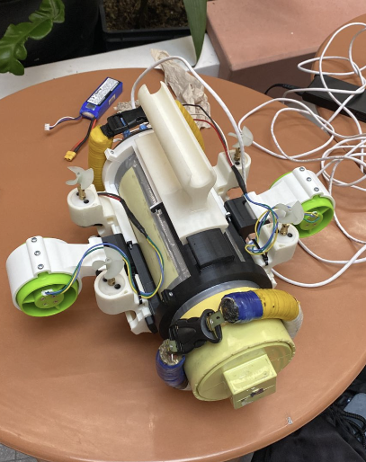
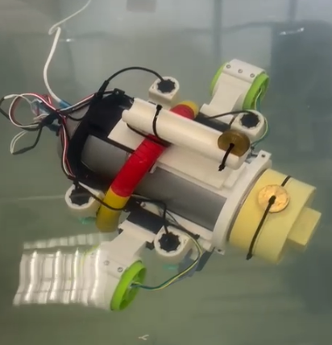

# Repository purpose

This repository recalls my little journey inside ros2 development stack. If you find this, either by chance or due to Rozo's guidance, i expect that these projects will help you navigate this environment.

| Robot   | Description                            | Requirements                                                           | Concepts to apply                                                      | Readme                              |
| ------- | -------------------------------------- | ---------------------------------------------------------------------- | ---------------------------------------------------------------------- | ----------------------------------- |
| ABB     | Serial Manipulator 6 DOF (6R)          | - Ros2 Humble - ros2_control + controllers - gazebo ignition | - Trajectory planning - Motion control - Hardware interfaces | [ABB](./abb/README.md "abb readme")       |
| SCARA   | Serial Manipulator 4 DOF (2RPR)        | - Ros2 Humble - ros2_control + controllers - gazebo ignition | - Trajectory planning - Motion control - Hardware interfaces | [SCARA](./scara/README.md "scara readme") |
| AGV-EIA | Mecanum wheeled mobile robot           | - Ros2 Humble                                                          | - Obstacle avoidance - Live mapping and navigation                | Private Pkg                         |
| ROV-EIA | Underactuated underwater vehicle 5 DOF | - Ros2 Humble - ros2_control + controllers                        | - Trajectory planning in 3D - Motion control in 5 DOF             |  [ROV](./rov/README.md "rov readme") |

> Table.1 Projects undertaken over this timespan

# ABB IRB140 robot (WIP)

> Fig.1 IRB140-ABB robot

# SCARA robot (WIP)

> Fig.2 EIA's In-house SCARA robot

# ROV-AUV robot (WIP)

> Fig.3 early prototype underwater vehicle