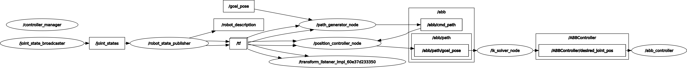
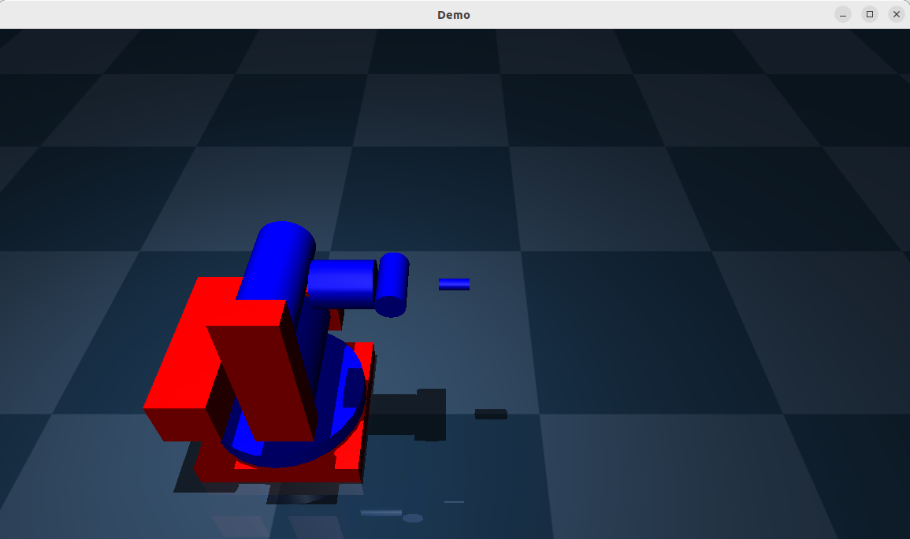
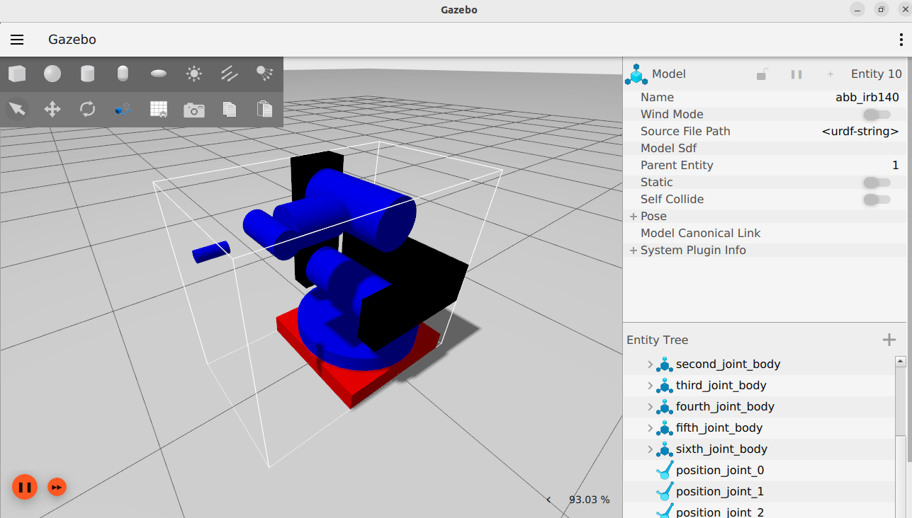

# ABB

## Description

This folder contains all the necessary files to simulate and interface an IRB140 ABB 6 DOF serial manipulator robot, available at EIA University.

The ABB IRB140 sits at students disposition at the robotics systems lab, it includes the robot controller, designated computer and a tableboard meant for the robot's operation and testing.


> Fig.1 Robot's workspace on the lab

The robot runs RobotWare 5.30, and has PC Interface and Multitasking packages available for machine-to-machine communication.

# Simulating the ABB-IRB140 on MuJoCo / Gazebo

The ABB-IRB140 simulator was built over ROS2, in integration with MuJoCo and Gazebo simulators by ros2_control hardware interfaces and controllers for quick interfacing.

## MuJoCo Simulator



> Fig.2 Simulation Node structure

The ABB-IRB140's mujoco simulator has the following components:

- ***Path generator node***$\rightarrow$Node responsible for path generation between provided goal poses. It generates path's on the global frame of reference
- ***Position controller node*** $\rightarrow$Node responsible of translating the path into individual target pose commands, evenly spaced in time
- ***ik solver node***$\rightarrow$Node responsible of applying inverse kinematics and generating joint target positions from the individual goal poses
- ***robot state publisher*** $\rightarrow$Node responsible of publishing the robot description and tf for rviz2 visualization
- ***joint state publisher*** $\rightarrow$Node responsible of publishing joint states. On the current configuration it exposes avery state interface as such
- ***abb controller*** $\rightarrow$Node responsible of getting the desired joint positions and transporting them into MuJoCo.

---

The ROS2 structure is ment to be run inside a docker container by using vscode *[dev containers](https://code.visualstudio.com/docs/devcontainers/containers)* tools.

To run the simulation, reopen the rov_ws folder inside a dev container and build the simulator:

```shell
colcon build 
```

Then:

```shell
ros2 launch abb_mujoco_bringup abb_bringup_launch.launch.xml
```

With the following listed ros2_control hardware interfaces and controllers:


> Fig.3-4 active controllers and interfaces on the mujoco-sim execution

## Testing simulations

Once the simulator has started, you can interact with the rober by posting msgs into the `/goal_pose topic`.

To try it out in terminal, manually publish the goal pose:

```shell
ros2 topic pub /goal_pose geometry_msgs/msg/PoseStamped "{
  header: {
    stamp: {sec: 0, nanosec: 0},
    frame_id: 'world'
  },
  pose: {
    position: {x: 0.55, y: 0.2, z: 0.4},
    orientation: {x: 0.0, y: 0.0, z: 0.0, w: 1.0}
  }
}" --once
```

Once the node structure recieves the msg, the following should happen on rviz2, as the simulator advances:



> Fig.5 MuJoCo simulator view

In the rviz2 visualization, the generated path trajectory is displayed in green. the respective coordinate system transformations will also be displayed on screen and the tool motion will be shown in the transformation.


> Fig.6 Rviz2 visualization for simulations

## Using the Gazebo simulator

To execute the gazebo simulator, the only necessary change to the structure is to change the launch file:

```shell
ros2 launch abb_gz_bringup abb_launch.launch.xml
```


> Fig.5 Gazebo simulator view

The Rviz2 visualization and node structure stay coherent.