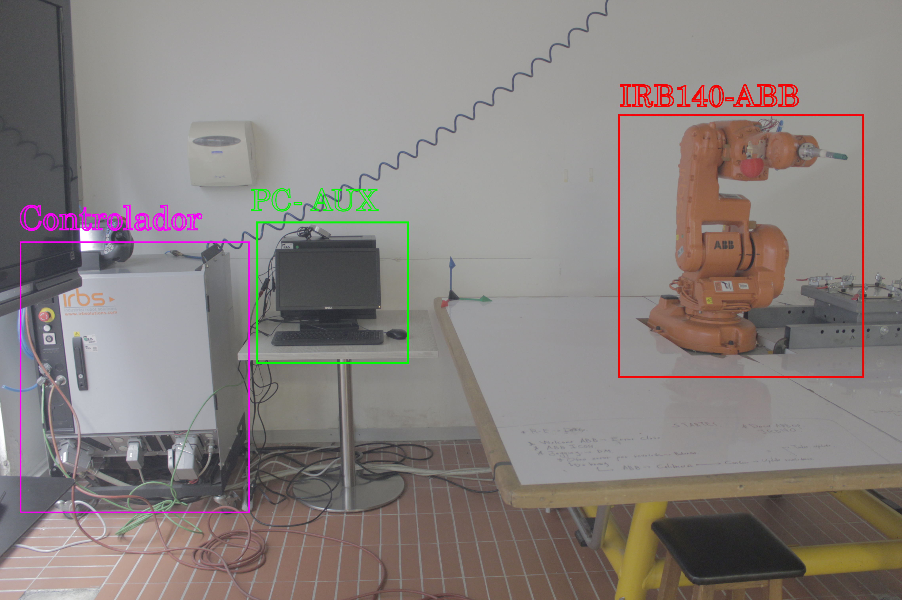
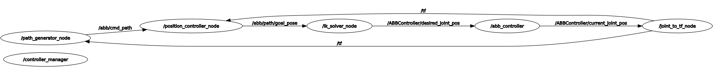
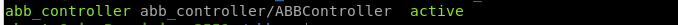
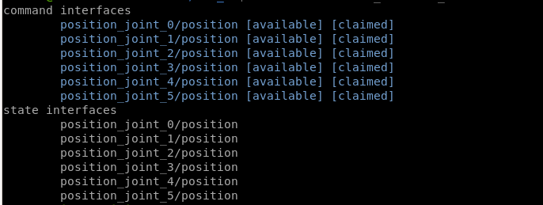
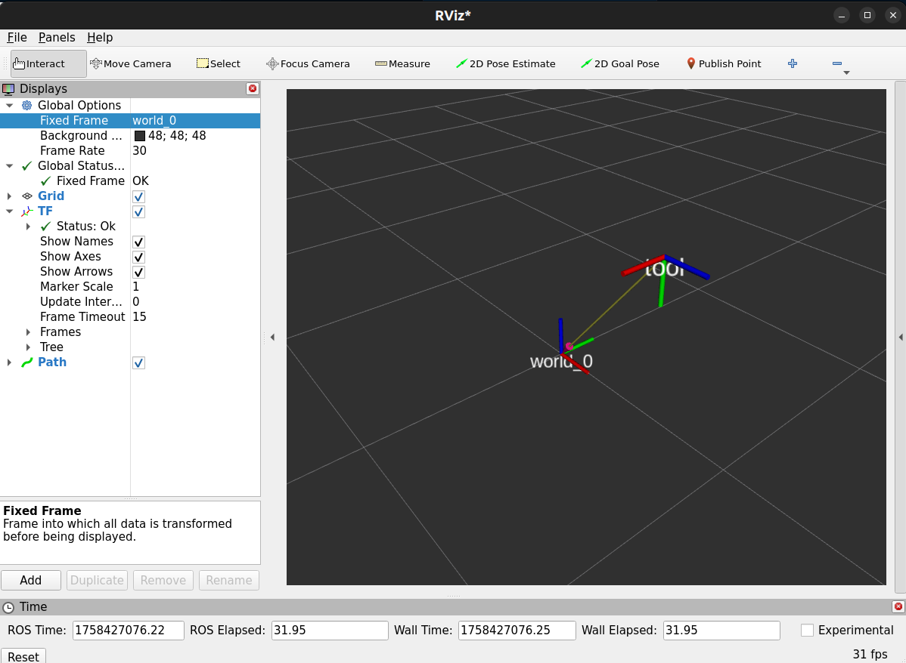
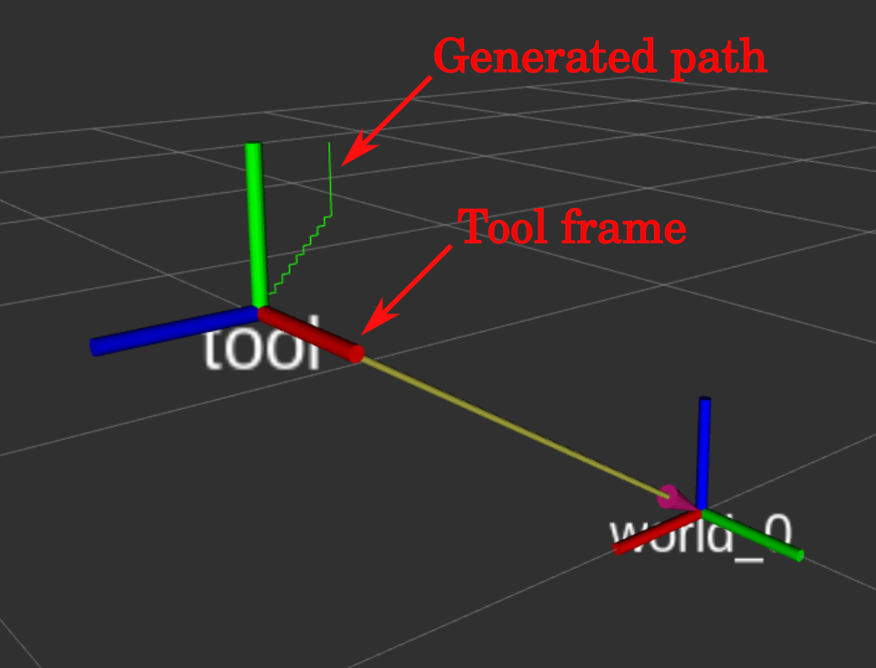

# ABB

## Description

This filder contains all the necessary files to simulate and interface an IRB140 ABB 6 DOF serial manipulator robot, available at EIA University.

The ABB IRB140 sits at students disposition at the robotics sytems lab, it includes the robot controller, designated computer and a tableboard meant for the robot's operation and testing.



The robot runs RobotWare 5.30, and has PC Interface and Multitasking packages available.

# Simulating the ABBIR140 on MuJoCo / Gazebo

The ROV-AUV simulator was built over ROS2, in integration with MuJoCo and Gazebo by ros2_control hardware interfaces.

## MuJoCo Simulator



The  ABB's mujoco simulator has the following components:

- ***Path generator node***$\rightarrow$Node responsible for path generation between goal poses
- ***Position controller node*** $\rightarrow$Node responsible of translating the path into individual target pose commands
- ***ik solver node***$\rightarrow$Node responsible of applying inverse kinematics and generating joint target positions from the individual goal poses
- ***joint to tf node*** $\rightarrow$Node responsible of translating the real joint positions to end effector pose.

The `abb_controller` and `controller_manager` nodes are ros2_control components.

---

The ROS2 structure is ment to be run inside a docker container by using vscode *[dev containers](https://code.visualstudio.com/docs/devcontainers/containers)* tools.

To run the simulation, reopen the rov_ws folder inside a dev container and build the simulator:

```shell
colcon build 
```

Then:

```shell
ros2 launch abb_mujoco_bringup abb_bringup_launch.launch.xml
```

With the following listed ros2_control hardware interfaces and controllers:





## Testing simulations

Once the simulator has started, you can interact with the rober by posting msgs into the `/goal_pose topic`.

To try it out in terminal, manually publish the goal pose:

```shell
ros2 topic pub /goal_pose geometry_msgs/msg/PoseStamped "{
  header: {
    stamp: {sec: 0, nanosec: 0},
    frame_id: 'world'
  },
  pose: {
    position: {x: 0.7, y: 0.0, z: 0.6},
    orientation: {x: 0.0, y: 0.0, z: 0.0, w: 1.0}
  }
}" --once
```

Once the node structure recieves the msg, the following should happen on rviz2, as the simulator advances:



In the rviz2 visualization, the generated path trajectory is displayed in green. the respective coordinate system transformations will also be displayed on screen and the tool motion will be shown in the transformation.



## Using the Gazebo simulator
