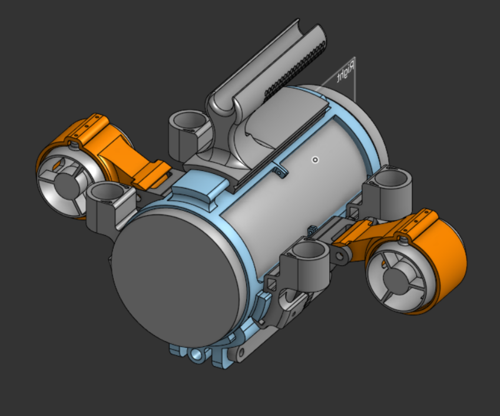
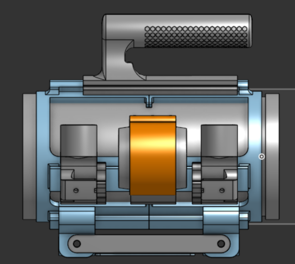
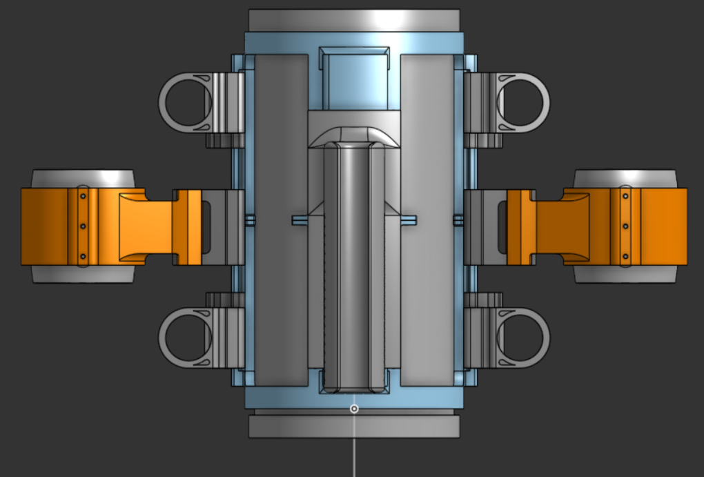
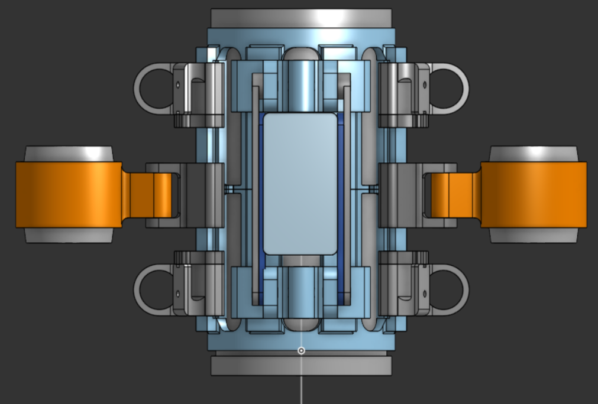
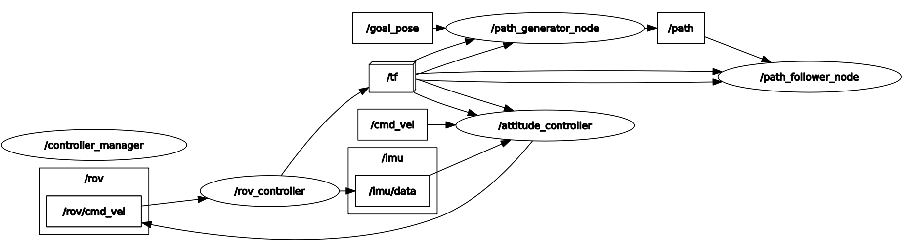
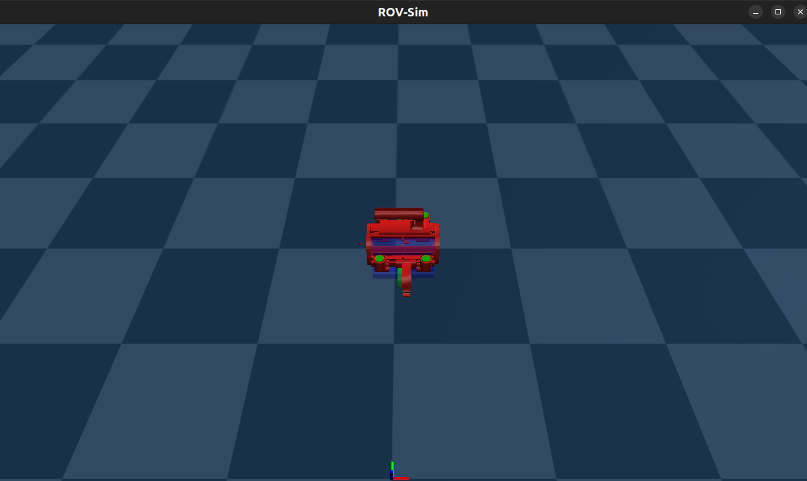
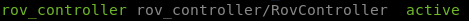
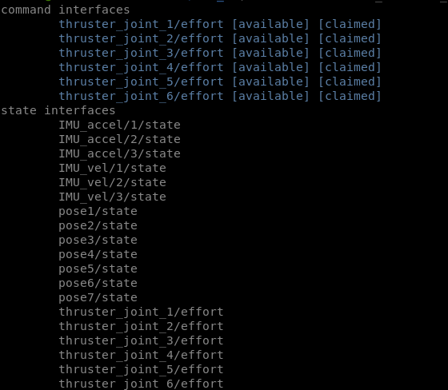
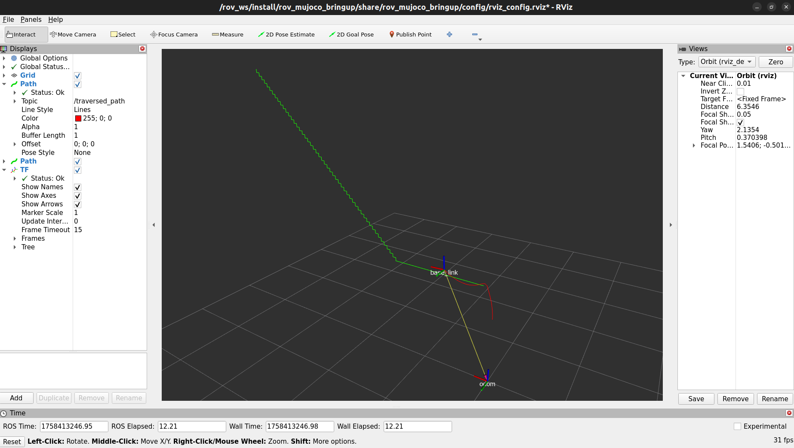
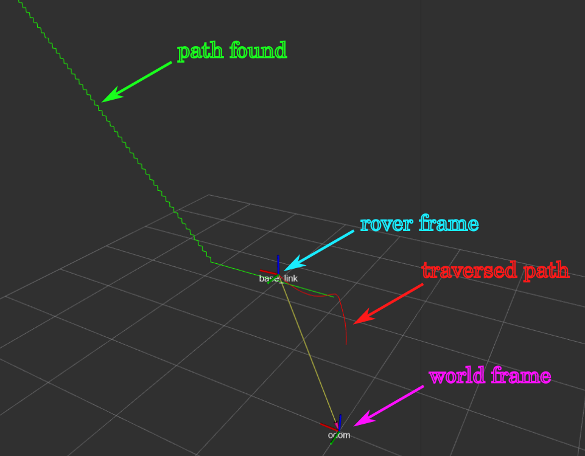

# ROV - AUV

## Description

This folder contains the project files for the EIA's autonomous underwater vehicle project.

You'll find among the contents of this folder:

* PCB Related files for the electronics manufacturing and set-up.
* All related simulation files, including the whole ROS2 structure interfacing with MuJoCo.
* All CAD files and auxiliary information for manufacturing.

# Robot overall structure

The robot is proposed as a 6 thruster underwater vehicle, with direct actuation over its forward-backward and up-down displacement, and mayor axis rotation capabilities, effectively becoming a 5 DOF robot.









The desing was created over a 4 inch PVC pipe hull for simplycity and impermeabilization effectiveness.

The **Devices BOM** is found bellow:

| Function                                          | Element                         | Qtty | Lik                                                                                                                                                                                                                                                                                                                                                                                                                                                                                                                                                                                                                                                    | Status                   |
| ------------------------------------------------- | ------------------------------- | ---- | ------------------------------------------------------------------------------------------------------------------------------------------------------------------------------------------------------------------------------------------------------------------------------------------------------------------------------------------------------------------------------------------------------------------------------------------------------------------------------------------------------------------------------------------------------------------------------------------------------------------------------------------------------ | ------------------------ |
| Vertical thruster                                 | BM70 Brushed Submarine Thruster | 4    | **[Amazon](https://www.amazon.com/-/es/BM70/dp/B0BF5KZVPN/ref=sr_1_6?crid=MQD4XE0IY6RU&keywords=underwater%2Bthruster&qid=1706275905&sprefix=underwater%2Bthru%2Caps%2C182&sr=8-6&th=1 "Z motors link")**                                                                                                                                                                                                                                                                                                                                                                                                                                              | Bought                   |
| Forward thrusters                                 | Generic Submarine Thruster      | 2    | [Aliexpress](https://a.aliexpress.com/_m0UtmGH "motors")                                                                                                                                                                                                                                                                                                                                                                                                                                                                                                                                                                                                     | Bought                   |
| Running node structure                            | Raspberry Pi 4 - 4Gb            | 1    | [Amazon](https://www.amazon.com/-/es/Raspberry-Modelo-2019-Quad-Bluetooth/dp/B07TC2BK1X/ref=sr_1_1?__mk_es_US=%C3%85M%C3%85%C5%BD%C3%95%C3%91&crid=1FHLVDZ1Q2BBR&dib=eyJ2IjoiMSJ9.HavuMzOx0pibLLpdWCmY00k6Sz1h7IjNXYchbCG7xmedy3COK_RvWlJRJ12dLyj2oQVRRHb1-n26nFJY3-XF5FDWuALo3hzuaqv3pmQpCvNGOLhmTWKllF4xurG1qaY37BBzrih8scHpER_O4aKOQPZj12rSnblF_HT9pCWFeAqMB4ISCBUpWA2BztUiQxvWZhaMUW8CpM0ncBtefC7sxpzdKNKZnltWqufSbLx6ii4.s2QSr3SNi9c302QiJKfXFX4L6YG6riwExw3Q1Q-t_Xc&dib_tag=se&keywords=raspberry%2Bpi%2B4&qid=1758676385&sprefix=raspberry%2Bpi%2B%2Caps%2C255&sr=8-1&th=1 "Raspberry")                                                               | Available at institution |
| Inertial variables mesuring/Forward motor control | PiXHAWK PX4 module              | 1    | [Amazon](https://www.amazon.com/-/es/Readytosky-Controlador-interruptor-seguridad-expansi%C3%B3n/dp/B07CHQ7SZ4/ref=sr_1_3?__mk_es_US=%C3%85M%C3%85%C5%BD%C3%95%C3%91&crid=SBSWB7RIQACH&dib=eyJ2IjoiMSJ9.OYvXkyN1sXdrHYEbR9pS3ZX-X9wuFjMDH029tfmzb-ll9TSKmYSZJGXb3Yr07U5U2ON7BxntI3asE_-SF6vNxoarV7IRQxKxGPflK5lknWtx-wiRTyFZ0lHCv0lG-WwSlNghgUge3pJiAdl3IqMOmFbif2yYQLXoLAmQa2xw_Mq5x0RmxiksHTdszDVwi5KmlUyJep4LEezuJ71OwRMnHvSTw86UZWNdKDEzXl0nGmlzuBTmYeAQym0jqlGmI9gQK62stky3OKcYLBbspHWrcX181tEHgZ3HwAzpawutKd0.p_mp_rxdDq0-WHlqUp3swMb6V9lb7J60oJ2UC6Q--cg&dib_tag=se&keywords=Pixhawk+PX4&qid=1758676487&sprefix=pixhawk+px4%2Caps%2C196&sr=8-3 "PX4") | Available at institution |
| Vertical thruster control                         | Project PCB                     | 1    | ----                                                                                                                                                                                                                                                                                                                                                                                                                                                                                                                                                                                                                                                   | Available at institution |
| Vehicle operation                                 | Generic joystick                | 1    | [Amazon](https://www.amazon.com/-/es/Logitech-mando-de-videojuegos-F710/dp/B0041RR0TW/ref=sr_1_14?__mk_es_US=%C3%85M%C3%85%C5%BD%C3%95%C3%91&crid=1S16ASHA95NDL&dib=eyJ2IjoiMSJ9.mUC39JhTS6TyENepJEJKEjEK2aW5ANayaJs6hq8vS2qrmusYbSWx8wMBE1uEGE5Ka5Pfs3J7ZXUfZNQHlV8HFG-yN5IPTMt8G87A3qeAHJlYJxULv0Yr6rFs2MNqhkekkU7fLIXC5nsdWMg7byAzVVds2VONbQD1vLACWjHumyBEF3I12ng7d4ABH1UD-CQyvsqOH9G1O-3xLGBWMqXqgAYtAX9zPgGM24vE4XEJhSA.6hITrj1MzvVGE1PEdJMXxPXX429YDozCocd67T9Jcsg&dib_tag=se&keywords=Logitech%2Bjoystick&qid=1758676427&sprefix=logitech%2Bjoystick%2Caps%2C187&sr=8-14&th=1 "Controller")                                                           | Available at institution |

> For a deeper sight into the manufacturing side, go [here](docs/MANUFACTURING.md "design and manufacturing process").

> For a deeper sight into the custom PCB side, go [here](docs/ELECTRONICS.md "design and manufacturing process").

# Quickly Simulating the ROV - AUV on MuJoCo

The ROV-AUV simulator was built over ROS2, in integration with MuJoCo by ros2_control hardware interfaces.

The generated node structure is shown bellow:



Inside the node structure, two main componens are to be highlighted, `attitude_controller` and `path_follower` nodes. Both nodes handle the lower and highter level control tasks, stabilizing the system and commanding it to follow the desired path. The necessary information for control tasks is sent by the `/imu` topic and `/tf` .

> For further description on the control proposal go [here](docs/CONTROL.md "control description").

---

The ROS2 structure is ment to be run inside a docker container by using vscode *[dev containers](https://code.visualstudio.com/docs/devcontainers/containers)* tools.
Take into account that the image ised for the project runs under the _64x86_ architecture, check your devices compatibility before continuing.

To run the simulation, reopen the rov_ws folder inside a dev container and build the simulator:

```shell
colcon build 
```

Then:

```shell
source install/setup.bash
ros2 launch rov_mujoco_bringup rov_bringup_launch.launch.xml
```

The expected result should be:



With the following listed ros2_control hardware interfaces and controllers:





## Testing simulations

Once the simulator has started, you can interact with the rober by posting msgs into the `/goal_pose topic`.

To try it out in terminal, manually publish the goal pose:

```shell
ros2 topic pub /goal_pose geometry_msgs/msg/PoseStamped "{
  header: {
    stamp: {sec: 0, nanosec: 0},
    frame_id: 'world'
  },
  pose: {
    position: {x: 4., y: 0.0, z: 4.},
    orientation: {x: 0.0, y: 0.0, z: 0.0, w: 1.0}
  }
}" --once

```

> The controller isn't _timestamp - frame id_ sensitive.

Once the node structure recieves the msg, the following should happen on rviz2, as the simulator advances:



In the rviz2 visualization, the generated path trajectory is displayed in green, as the traversed path generates with red color. the respective coordinate system transformations will also be displayed on screen.



# System's current state

The current system's state its operational, with Integrated EKF attitude estimation (Derived from px4-ros), Current consumption & Voltage level indication & open-loop control.


