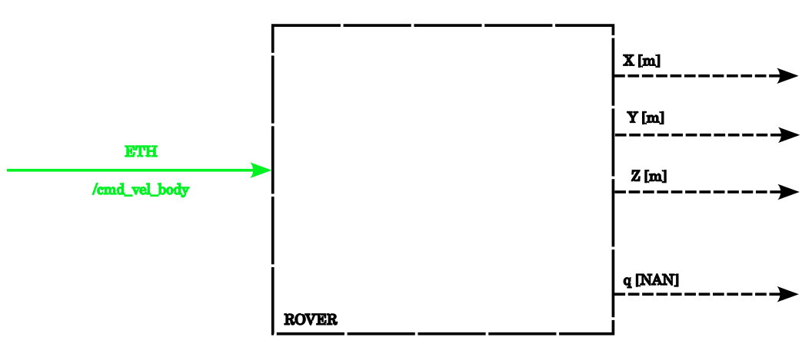
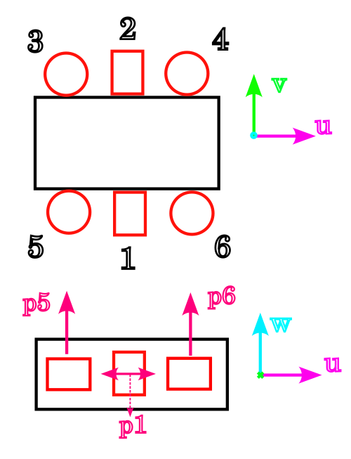
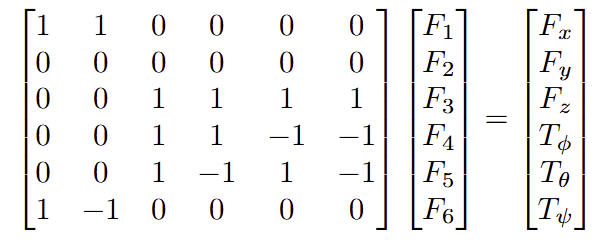
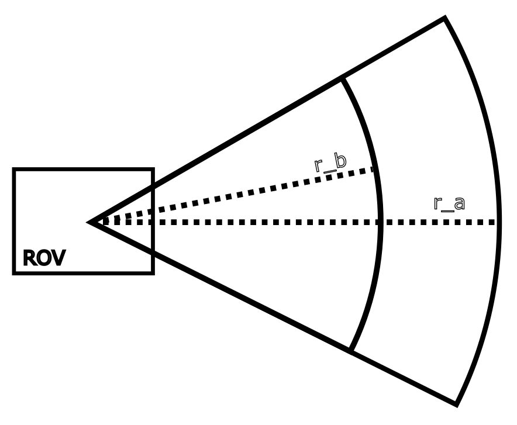
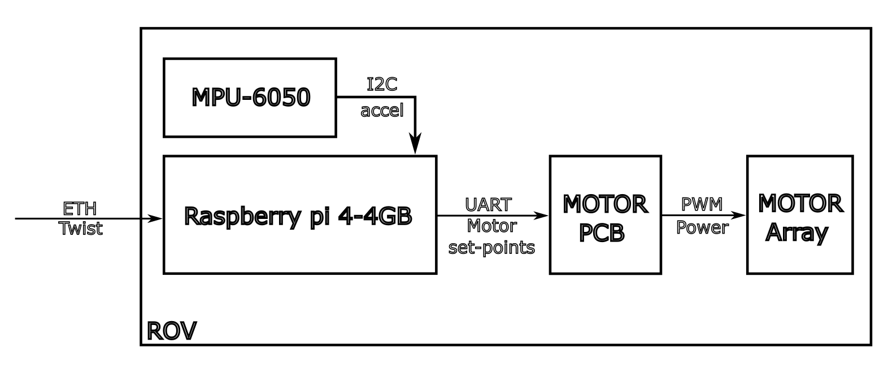

# Control proposal

## ROV - AUV simplified model

Before taking into consideration any dynamic-related aspect of the ROV system, we can consider the device as a black-box model:

> Fig.1 Black box diagram of the system
 
Considering the resources available, it was decided to arrange the actuators on the system so the final structure has 5 DOF directly actuated, conveniently dividing the system into a QuadCopter-Like and Differential-thrust systems, which greatly simplifies the control strategy.

First, we enumerate the actuators and define a local reference frame to operate under.

> Fig.2 Simple body diagram

In this sense, we will make some assumptions, such as uniform behavior among motors with a $\tau_{motor} << \tau_{system}$.

## Position controller

### Further simplifications

Considering that the motors response its way faster than the overalls system's dynamics, they can be considered as having _no dynamics_, effectively becoming a pass-through system converting input unto thrusts.

By using the previously shown motor configuration, we can set a linear map between the desired body forces and torques, and the motor's thrust output.

> Fig.3 Linear forces and torque map on the body frame

we can effectively define an stabilization task in the global frame by setting the desired $yaw$ and $pitch$ to 0. For simplicity, these angles will be denoted:  $\theta$ and $\phi$.

Further considering that the system is actuated by force, and the regulated variable its position, we can assume a type-2 system with underdamped behavior for a tentative proportional controller with the resistance generated by water. 

The feedback policy would be:

$$
T_\phi = -\phi k_1 \\ 
T_\theta = -\theta k_2
$$

> Eq.1 Angular feedback policy

So far so good, but considering that the angles $\phi$ and $\theta$ are measured against the global frame, we must find a way of measuring this state.

Fortunately, by assuring smooth thrust inputs, we can use gravity's $\vec{g}$ to get these angles via the magnetometer and some basic trigonometry:

$$
\theta = atan_2(a_y,\sqrt{a_x^2 + a_z^2}) \\ 
\phi = atan_2(-a_x,\sqrt{a_y^2 + a_z^2})
$$

> Eq. 2 global pitch and roll measurement eq

This stabilizes the system, and by cascading this regulator with the differential inputs, we can achieve tele-operation quite easily. 

It is to say, that depth follows the same dynamics, and its also controlled by a P controller of the form:

$$
F_z = (z_{ref}-z)k_3
$$
> Eq.3 Depth feedback policy

for this controller to be effective, we have to assume that the settling time for the angular regulation system is considerably lower than the depth regulator ($\tau_{\phi}, \tau_{\theta} << \tau_z$), else, we would have to deal with coupling on the dynamics.

This way, the only inputs we should worry about are the yaw and thrust inputs. The good side of this, is that considering that the force effectuated by the motors $1$ and $2$ is correctly aligned with the center of mass of the system, the dynamics become effectively decoupled, and we can treat the system as a higher order differential drive.

Considering drag, the dynamics can be simplified to:

$$
u = \begin{bmatrix} F_u \\ 
T_\psi \end{bmatrix} 
$$
$$
x = \begin{bmatrix}
 \dot{x} \\ 
 \dot{\psi} 
\end{bmatrix} | \ \ \dot{x} =  
\begin{bmatrix}
 -\rho_1|\dot{x}|\dot{x} \\
 -\rho_2|\dot{\psi}|\dot{\psi} 
\end{bmatrix} + u
$$

> Eq 4. Simplified dynamics

With $\rho_1$ and $\rho_2$ as _fluid-geometry_ dependent constants. This drag ensures system stability, and actually helps us a lot with the type 2 system issue from before.

## Position controller

The proposed position controller comes from geometric derivation and simplifies the position controller into the thrust policy, that feeds on the euclidean distance to the desired point and the current angular action $T_\psi$, and the angular policy, that feeds on the error against the current system orientation (to avoid _atan2-related_ issues).

We start from the assumption that the desired orientation is known and its expressed as an unitary vector $\vec{s}_b$. Afterwards, calculate the unitary-heading vector from the body to the reference point $\vec{u_e} = \frac{\vec{r_e}}{||\vec{r_e}||_2}$ The normalized error will be:

$$
\psi_e = cos^{-1}(\vec{u_e} \cdot \vec{s}_b) / \pi
$$

> Eq.5 Relative error expression

and its sign with:

$$
sign(\phi_e) = sign((R(-\phi)\vec{u_e})_y)
$$

> Eq.6 Relative error sign expression

This holds only in a 2D scenario, taking the z component directly to the depth regulator.

The whole control action would look like:

$$
T_\psi = (cos^{-1}(\vec{u_e} \cdot \vec{s}_b) / \pi)sign((R(-\phi)\vec{u_e})_y) k_1
$$
$$
F_u = \frac{||\vec{r_e}||_2 k_2}{1 + T_\psi k_3}
$$

> Eq.7 Thrust and yaw feedback policies

The little fraction trick its just to keep the linear and angular actions for interfering with each other.

This set-up guarantees convergence, but as its entirely reactive, and depends on type 2 systems, its perturbance rejection its entirely dependent on a good choose of $<k_1, k_2, k_3>$, which is not ideal for open waters scenario.

# Point selection

The strategy for goal point selection uses the euclidean distance over a boundary over a desired radius to select the goal point.

>Fig.4 Point selection boundary diagram

As the radius increases, the ROV response gets smoothed, and naturally softens the control action, mostly due to the softer heading changes for the yaw control.

This method offers adjustable trajectory tracking, letting us decide between tight path following vs loose but smooth, the only downside for this method is that convergence its only guaranteed for the final point in the trajectory. 

Another consideration for this method is that as the euclidean distance is the differential drive thrust input, the device's thrust is made dependent on the search radius. The search radius and the thrust could be made independent by normalizing the heading vector and selecting the thrust a downscaled version of the distance, or a piece-wise function of it $k_2 = \frac{f(\vec{r_e})}{||\vec{r_e}||_2}$.

# Planning strategy

For planning, a Greedy BFS algorithm was used to find the shortest path from point $A$ to $B$. There is, however no problem with the GBFS completeness as an algorithm, as there is no current obstacles nor map, meaning that the solution of the distance problem its trivial, and GBFS will converge to it. 

On the current implementation, it is possible to traverse the environment using as cost function the euclidean distance $||\cdot||_2$, or the Manhattan distance $||\cdot||_1$.

# Implementation

To implement the controllers on-board, the following devices were used:

Among the previous control proposals, the only ones implemented in hardware (due to schedule limitations) were the stabilization the controllers, by the feedback provided by an $mpu 6250$ off the shelve IMU. In the integration, its worth mentioning that a pixhawk PX4 is also present, but its capabilities were not used for the controller implementation. 

The node controller structure was executed at $10Hz$ , making the subsequent callbacks execute at that frequency. 

