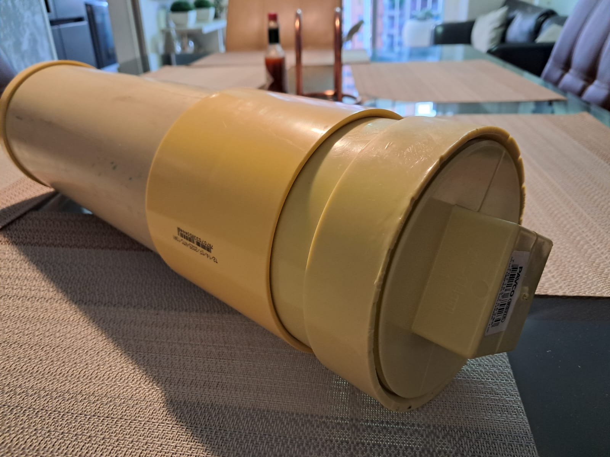
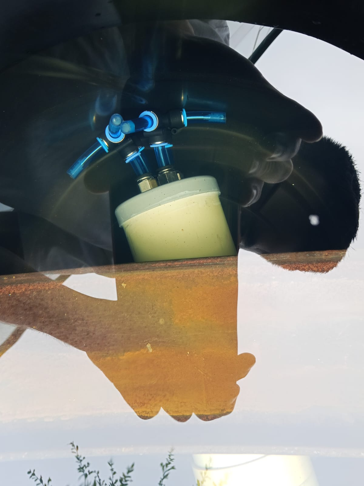
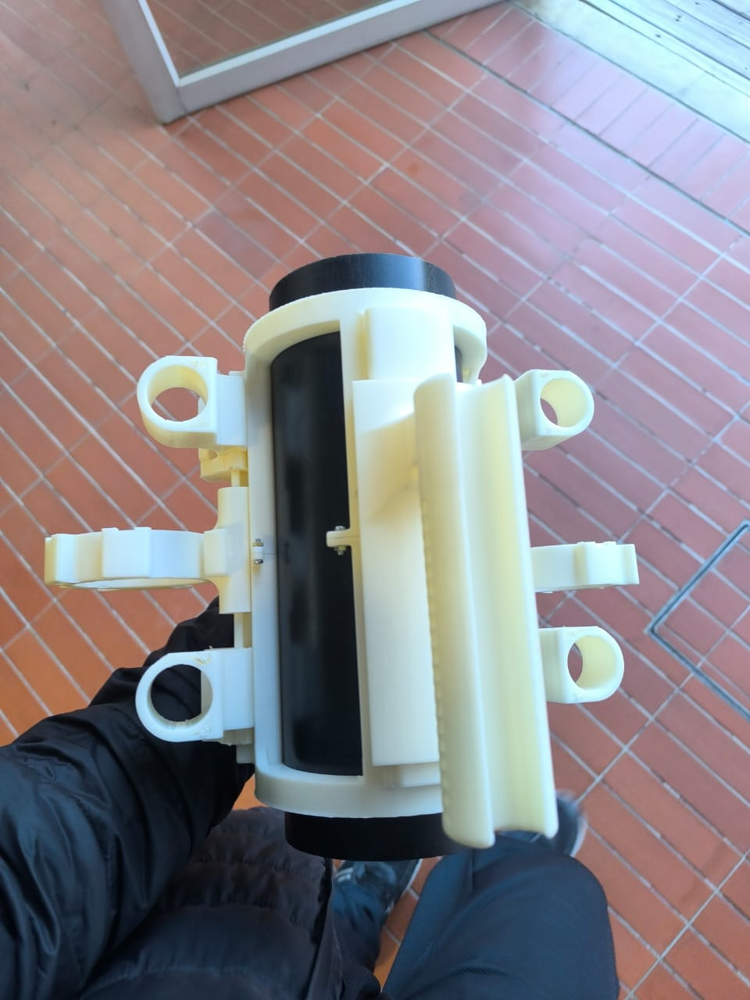
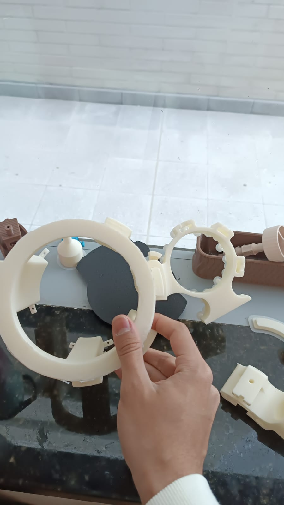

# ROV design and manufacturing process

The ROV desing was creating following 4 main objectives:

* Manufacturing optimization
* Monetary cost reduction
* Minimize failure points on the structure
* Allow future platform expansion

To address the manufacturing speed and optimization, 3D printing was chosen as the main manufacturing medium, using PLA and ABS as the proyect's base materials. The desing, reduces cost by leveraging the already waterproff properties of a PVC pipe based hull and using available materials and electronics at EIA's University. The use of PVC pipes and pneumatic fittings, makes the possible failure points predictable and allows for countermeasures. Finally, the rail-like exterior design allows for further proyect expansion and add-ons for further system development.

# Electric routing

For electronic routing, pneumatic fittings were chosen to serve as water-proof connections. To create the seal, the PVC caps were threaded by using a lathe, and epoxi resin was pured on the connection to prevent leaking. The result was tested by prolonged submersion under 1m depth water column.

# Printing process

To print the ROVs different parts, a 0.2 mm tolerance was used to secure friction fit between parts, and a selected layerheight of 0.2 mm was used to sucessfully print the outer hull.

# System assembly

The system assembly, as stated in the design objectives, was straightforwatd. The elemets were joined with screws and by friction fitting, making everything to slide into position.

