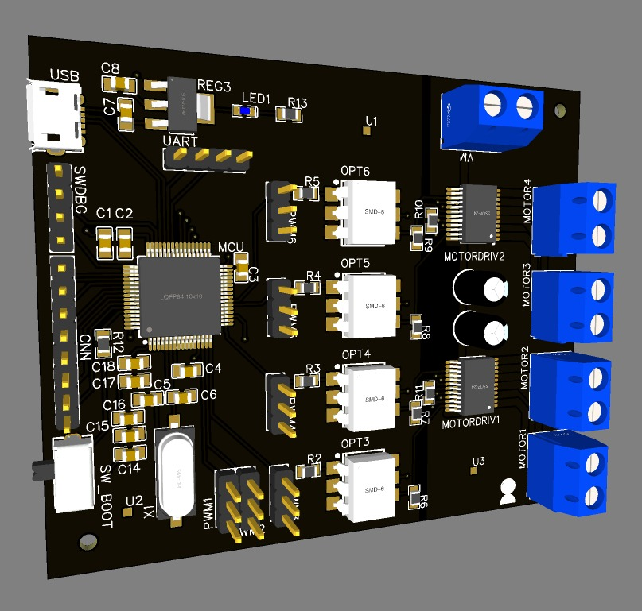
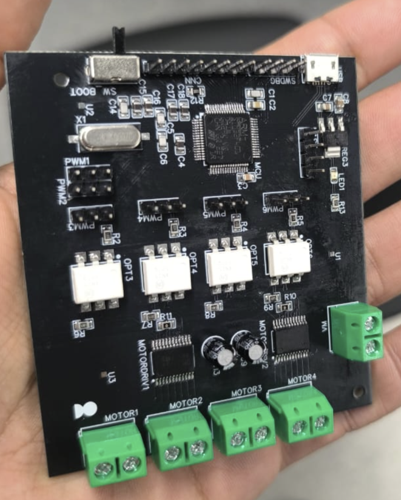
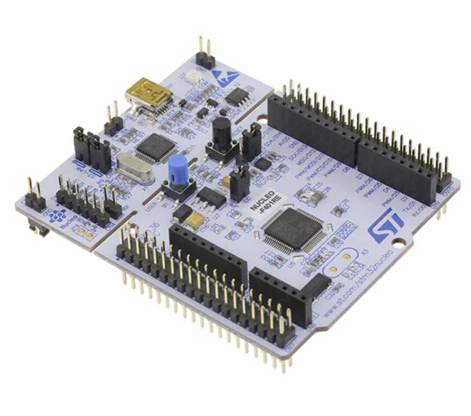
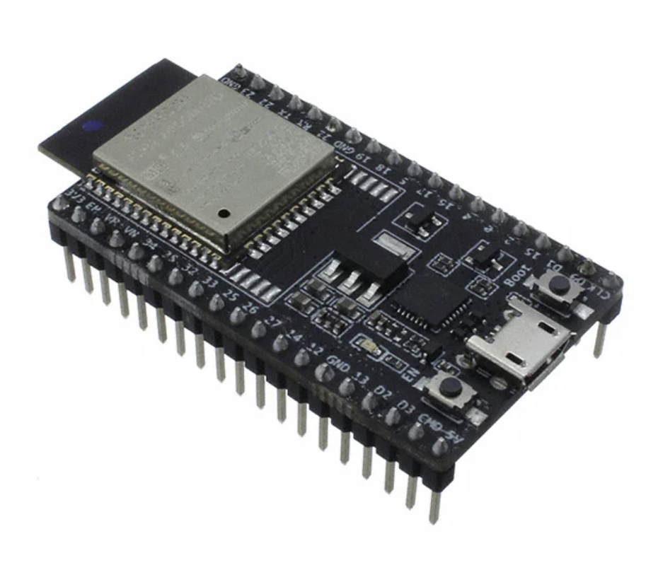
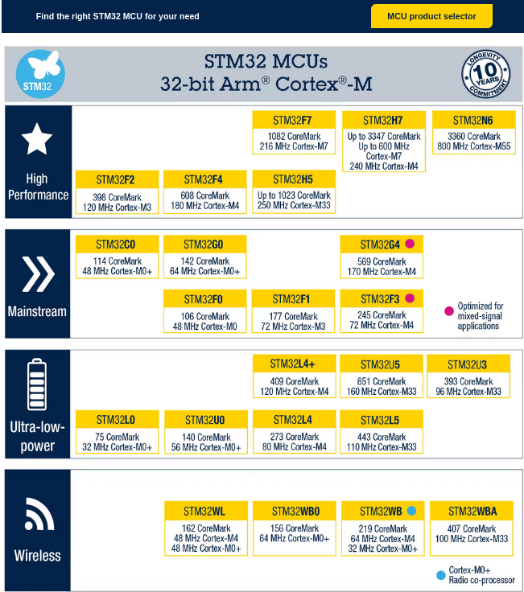
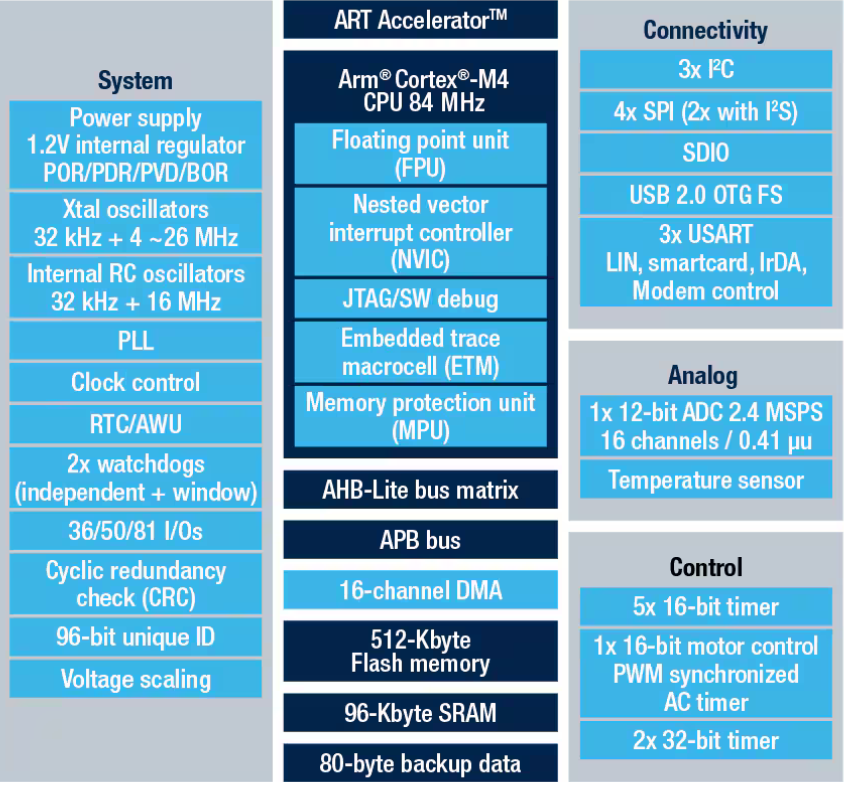
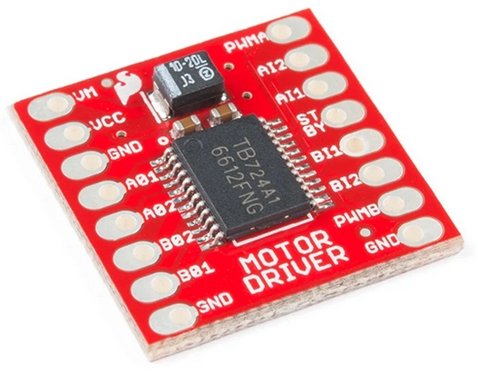
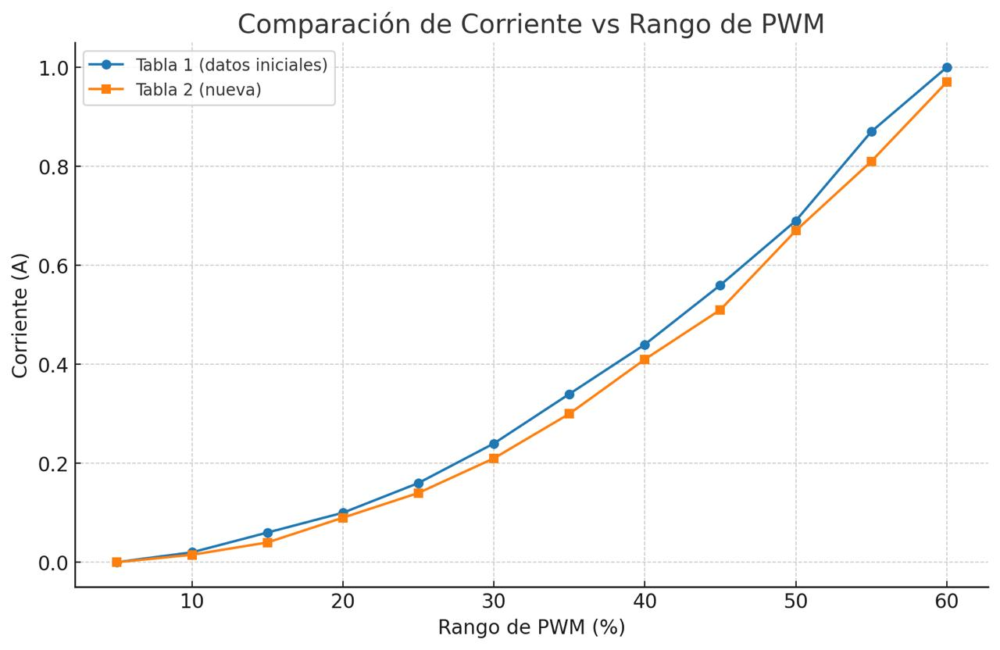
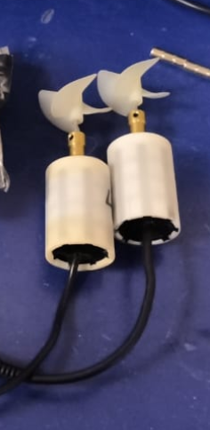
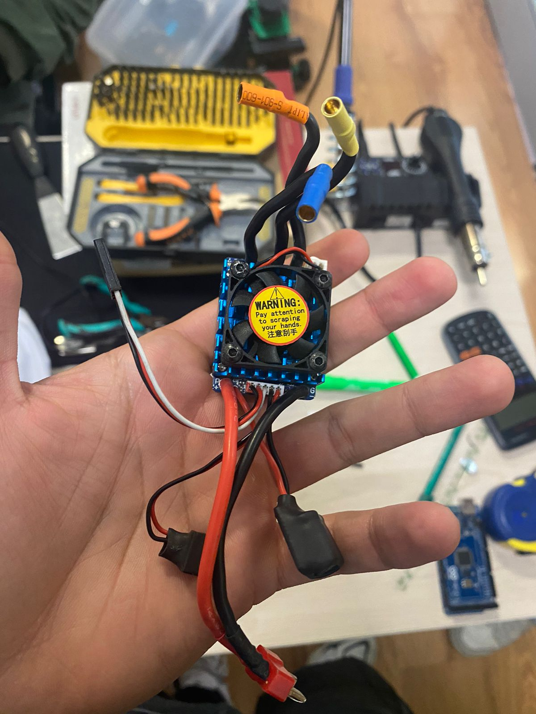

# Electronic design

For this project, a custom PCB design was proposed with the objective of maximize the usable space on the hull and minimize issues related with wiring.

The overall advantages of early investment on a pcb-based electronics solution include (in comparison with hand-soldered universal board):

- Fewer physical connection failure points
- Improved reliability under extensive physical manipulation
- Better component density

Some disadvantages of this approach, specially considering that the team had 1 shot at achieving a functional design:

- Increased _design-to-production_ time
- Possibility of unreliable suppliers, putting deadlines at risk
- Requirement on specialized equipment outside the institution. 

The PCB revolved around a simple idea, create a separated system that singlehandedly operates the motor operation, and exposes their controls as an UART interface. 

For this purpose, the MCU was selected between the ESP-32 series boards and the STM32 Series boards. (For deeper insight on the MCU selection look at the section [MCU selection.](#mcu-selection))

In the early design stages, a multi-board approach was considered, but considering that this was a single purpose board with no necessity of further expansion, a single board design was deemed the best approach.

A preview of the final design is shown bellow, alongside the final product:

> Fig.1-2 PCB design render, PCB design post-assembly

## MCU selection

The MCU selection process started out as a direct choice between using ESP-32 or STM32 based microcontroller, which was later decided by 4 major factors:

1. The MCU must be reliable, considering that the team only has one shoot to produce an operational device
2. The MCU must provide a enough PWM-capable output pins to feed the project (6 being the requirement)
3. The MCU must have a development board available at the institution 
4. It must give the team _bragging rights_.

The _3rd_ requirement narrowed down the boards to 2 options: The ESP-32-WROOM-32D, available at the university, alongside the STM32 series, with an STM32F401 nucleo board.

> Fig.3-4 Development boards for STM32F401 (Nulceo) and ESP32 (ESP32-WROOM-32D)

The _4th_ requirement closed-up the discussion as making a STM32-based design would give the team aura [(Aura farming - Wikipedia)](https://en.wikipedia.org/wiki/Aura_farming). 

Being serious, both MCUs are a perfectly viable option for the project, and greatly surpass the gpio, processing power and reliability requirements. The decision on going on the [Nucleo-Board](https://www.st.com/en/evaluation-tools/nucleo-f401re.html) path responded to board availability and genuine interest on experimenting with new MCUs and programming environments (STM32 CUBE-IDE). 

 
 For a quick review on MCU descriptions and capabilities:

The STM32 MCU family offers different microcontrollers depending on the user's requierements, specifically depending on the aplication. Some information on different STM32 MCU types is displayed bellow, taken from the manufacturer *ST*.

> Fig. 5 STM32 Family MCU general description

More indepht information can be found in online guides as [this one](https://www.digikey.com/en/maker/tutorials/2020/understanding-stm32-naming-conventions) offered by DigiKey.

### STM32F401RE

Some of the capabilities of the selected MCU are listed bellow as an [ST-Infograpic](https://www.st.com/en/microcontrollers-microprocessors/stm32f401re.html).

> Fig. 6 STM32F401RE capabilities

Considering the presented MCU features, the most relevant for this application is the _SW debugging_, which is not exclusive of this STM32 family and allows for quick and effective debugging, alongside the _USB 2.0 On the go_ interface.

## Drivers

The motor driver choosed for this application was the [TB6612FNG](https://cdn.sparkfun.com/assets/0/1/b/b/3/TB6612FNG.pdf), manufactured by toshiba. The driver its is ment for controlling a dual DC motor set-up, with per-channel current limitation of up to $1.2 A$(avg) and $3.2 A$ peak. The driver also integrates integrated thermal shut-down.

The driver operates at a maximum motor voltage of $13.5V$, which allows for the $12V$ motor operational voltage, but the current restrictions generate a restriction on the motor's ussage that must be adressed. Describing the thermal properties of the device, maximum power dissipation stands at $1.36 W$.

The driver is commonly found in the form of a bread-board [module](https://www.sparkfun.com/sparkfun-motor-driver-dual-tb6612fng-1a.html):

> Fig.7 tb6612fng motor driver

# Motor current identification

The motor used in the project, as previously stated, are [brushed CW waterproof off-the-shelve motors](https://www.amazon.com/-/es/BM70/dp/B0BF5KZVPN/ref=sr_1_6?crid=MQD4XE0IY6RU&keywords=underwater%2Bthruster&qid=1706275905&sprefix=underwater%2Bthru%2Caps%2C182&sr=8-6&th=1), which by early test drew over 1.5 Amps at expected load operation. To make sure that the motor operation wont put at risk the motor drivers, the power output must be capped.

The current was identified by measuring the drawn current and plotting it against the control signal input:

> Fig.8 Current identification curve 

> Fig. 9 Provided motors for testing (Pelles)

The curve output from the current consumption was utilized to set a hard-threshold on the 60% PWM duty_cycle to prevent possible driver damage, leaving ~20% of the available current for unexpected motor loads. Take into account that these current curves were identified by using the motors in their operation-worst-case environment (on a fixed frame, underwater).

At the moment of testing, there wasnt available all 4 motor for identification, but considering the close response of the first two motors, it was safe to assume that the other pair would behave as expected.

# Differential thruster motors and drivers

As the provided elements for the submarine included just 4 brushed-DC motors, the team took the decision on getting 2 off-brand water-board brushless motors for forward thrust. These motors are the ones responsible for the differential drive dynamics.

To adapt these motors into the control system, a toy-car motor driver was used, considering that it used a pwm interface which was identified and used in conjunction with the other 4 stabilization motors. 

> Fig. 10 Brushless motor drivers

The only caveat to this integration was that the power dissipation of the drivers greatly overpassed the dissipation capacity of the hull, overheating in some scenarios the electronics bay.

# Programming & Testing

The pcb design was oriented towards creating a device wich would be interfaced with via VCP, and by the use of formatted strings, send motor actuation commands to the board. By using the available USB_driver from [Cube-IDE](https://www.st.com/en/development-tools/stm32cubeide.html), the board was quickly setted up, and test where performed on the resulting device.

Testing was performed at EIA's University Electronics lab, and current bounds and power consumption was again verified with the new set-up, and new motors. Once the board passed quality test, the system was left as a _black box_ for motor operation
