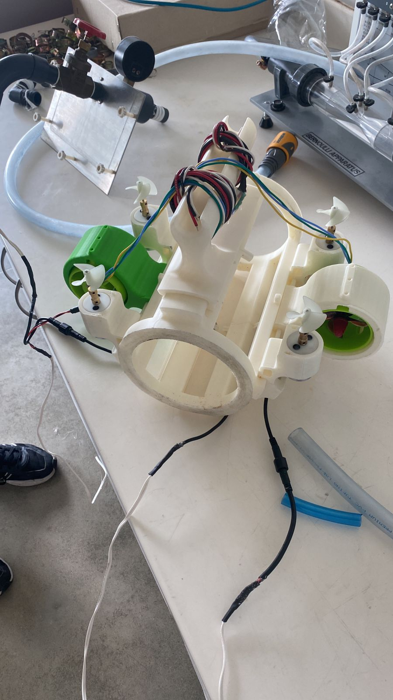
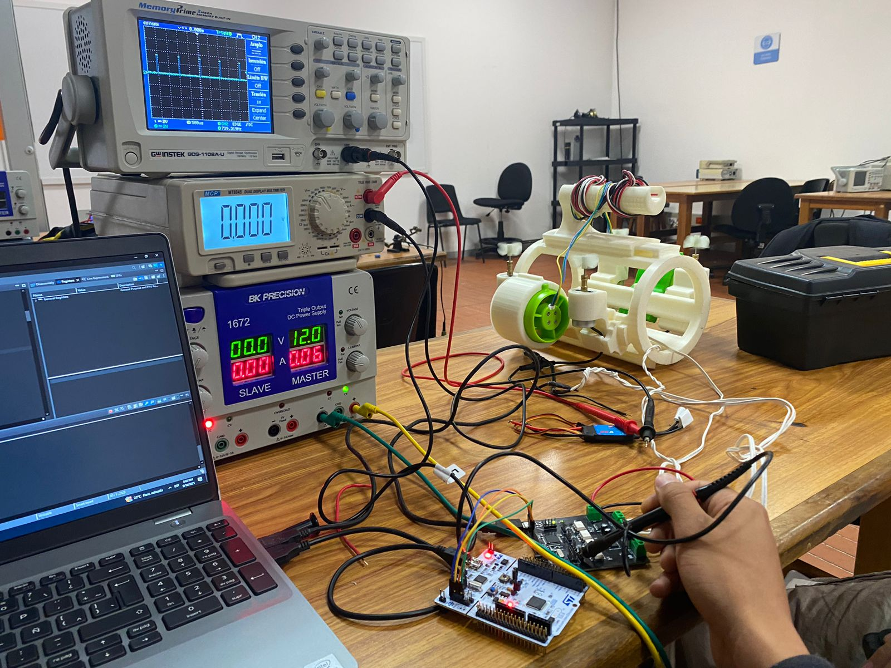
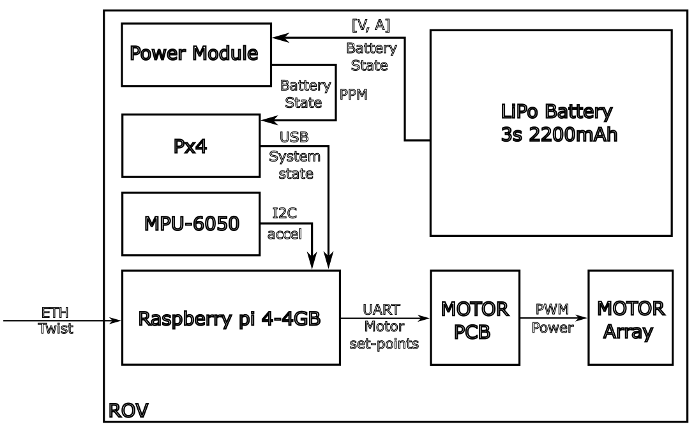
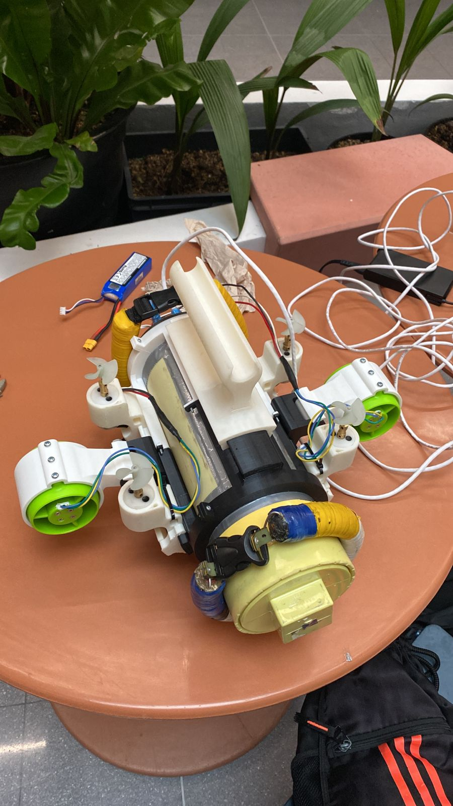

# Manufacturing process

The ROV design was created following 4 main objectives:

* Manufacturing optimization
* Monetary cost reduction (We're lowk broke)
* Minimize failure points on the structure
* Allow future platform expansion

To address the manufacturing speed issue and material usage optimization, 3D printing was chosen as the main manufacturing medium, using PLA and ABS as the project's base materials.

The design proposal also reduces cost by leveraging the already waterproof properties of a PVC pipe-based hull, and using available materials and electronics at EIA's University for diverse functions. The use of pneumatic custom-fittings, makes the possible failure points predictable and allows for countermeasures such as multiple-layered resin coating. Finally, the rail-like exterior proposal allows for further project expansion and incorporation of standalone specialized sections to the hull.

> Fig 1. Pvc pipe structure used for the Hull

# Electric routing

For electronic routing and waterproofing, pneumatic fittings were chosen to serve as connections. To create the seal, the PVC caps were threaded by using a lathe, and epoxy resin was poured on the connection on a multi-layer manner to prevent leaking. 

The result was tested by prolonged submersion under 1m depth water column, which was left overnight outside the laboratory (Being able to even withstand a heavy-rain that just so happened to fall that night).

> Fig.2 PVC structure used for pneumatic-fitting testing

# Printing process

To print the ROVs different parts, ABS (Acrylonitrile Butadiene Styrene) was initially selected as printing material, for its chemical resistance to corrosion and overall strength. Later in the development process, PLA had to replace ABS as structural material due to availability in the university's workshop.  

The ROV was entirely printed in the university's workshop on a _CrealityK2_ 3D printer, using generic brand filament. 

A 0.2 mm tolerance was used to secure friction fit between parts, and a selected layerheight of 0.2 mm was set to successfully print the outer hull.

The system assembly, as stated in the design objectives, was straightforward. The elements were joined together by M3 screws and friction fitting.

> Fig.3 First assembled outer-hull structure, full ABS

# System assembly

The outer rail design facilitated greatly the assembly process, and made redesigning some features non destructive to the rest of the structure.

> Fig.4 Sparse build parts for the hull v2, mixture of ABS & PLA

Another plus of the rail-like structure is that it allowed easy cable routing throughout the hull structure, being something huge for _QOL_.

> Fig.5 Wiring-up process for the hull

To test the thrust circuit, a plastic container fill to the brim with water was employed, as there were no access to a pool or greater testing environment at the moment. 

>Fig.6 Testing the control board & PWM output

Once the electronics were properly tested out, and the whole integration worked in the bench, the system was put together on the electronics rail and prepared for immersion test. A general block diagram of the devices used in the final set-up is shown bellow.

> Fig.7 General block diagram for the ROV

Finally, some additional ballast had to be used for the system to achieve neutral buoyancy, but the overall structure was not compromised by this. In future designs, this would translate to higher print density.

> Fig.8-9 Full ROV construction, before final presentation.