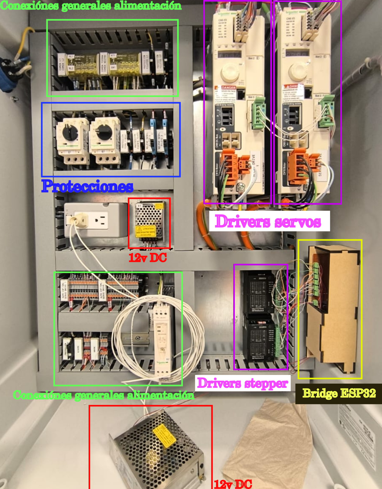
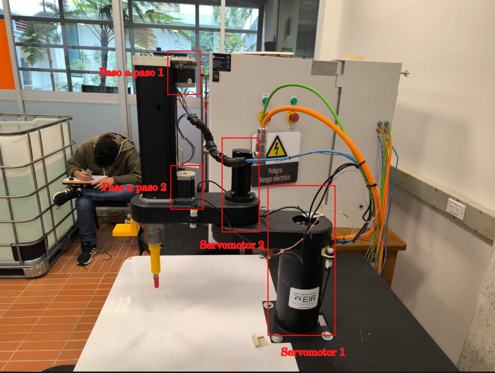
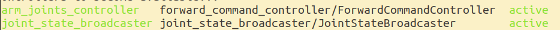
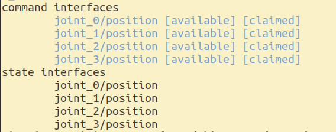
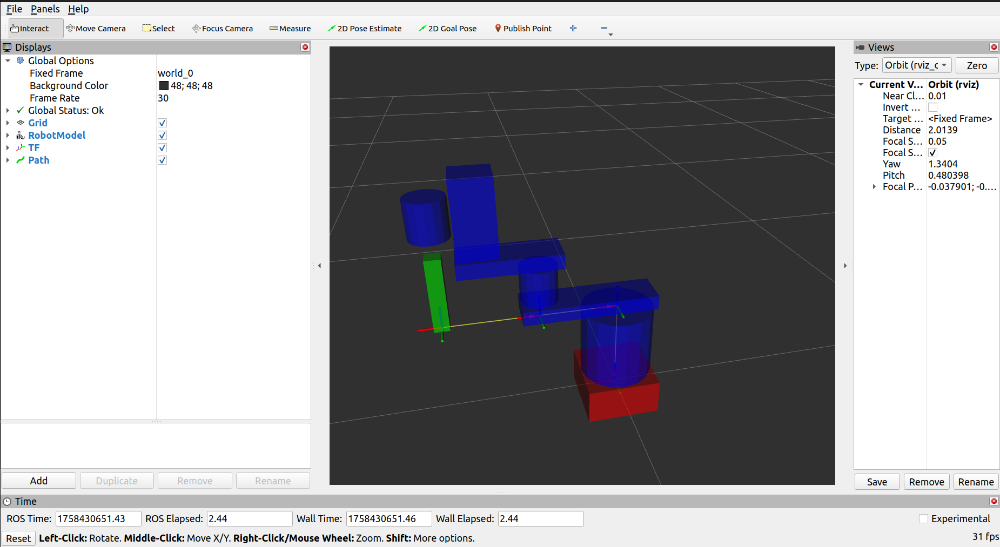
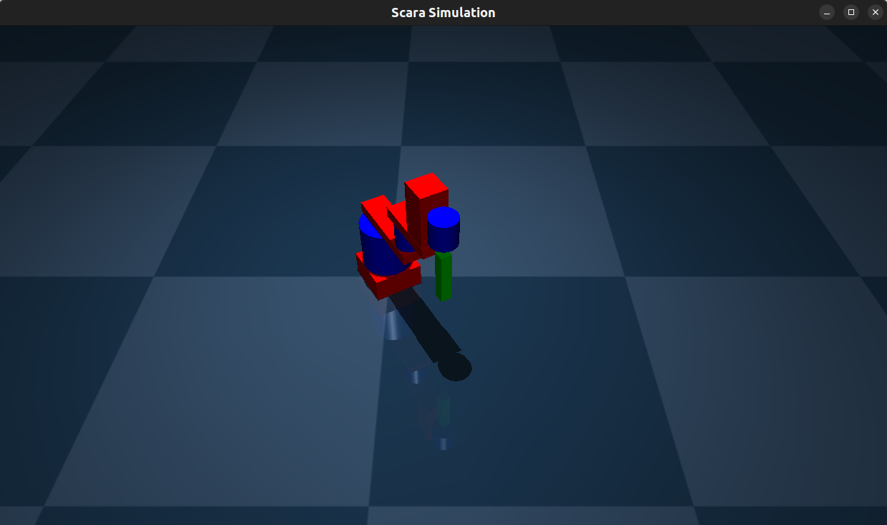
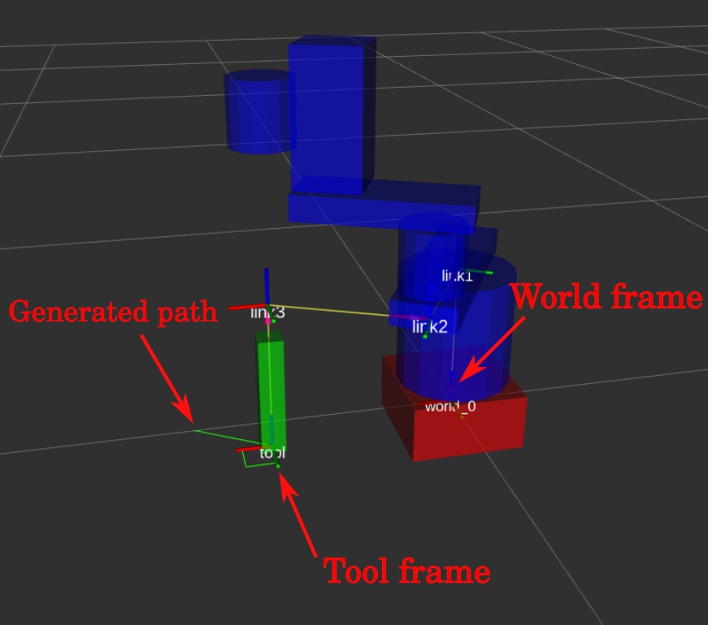
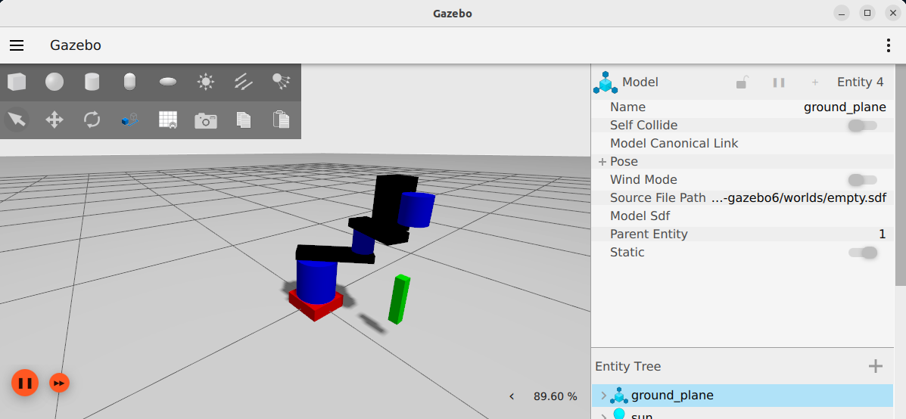
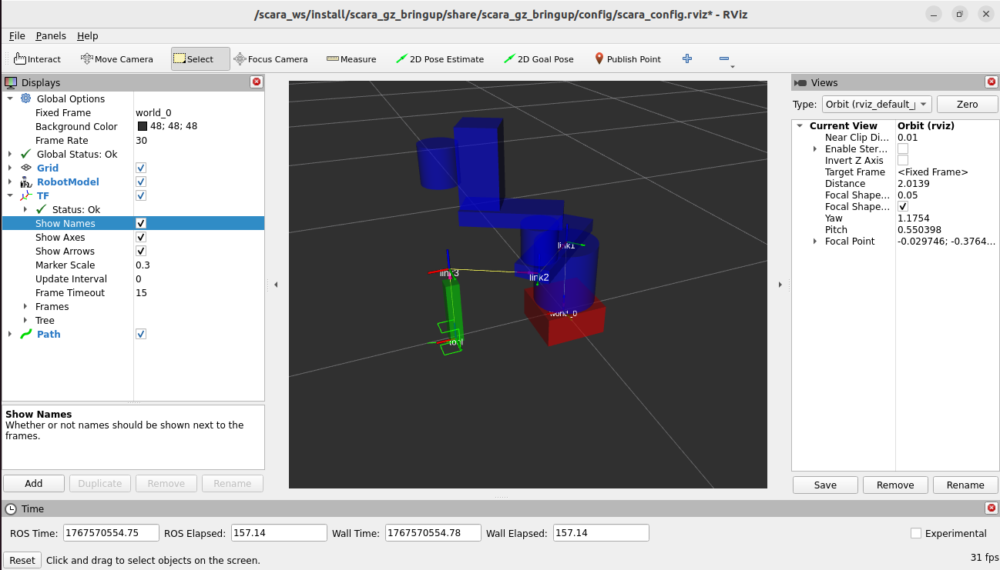

 # SCARA - Serial manipulator

# Definition

An SCARA robot (Selective-Compliance Articulated), is a distinct type of robot manipulator widely used in the industry. The SCARA robot usually takes the configuration of a 2RP manipulator, used for pick and place tasks. These kind of robots rely in repeatability and accuracy on their movements.

In the EIA's University an SCARA robot sits at student's disposition, it uses 2 Servomotors *Schneider BSH0551T32A2A*, along with 2 *Schneider LMX32* drivers to interface with them. For its 3rd and fourth DOFS, the SCARA uses 2 *Nema 23HS30-2804S* stepper motors, connected with gears and a rack-pinion mechanism to achieve the translation and rotation of the end-effector.

A brief showcase of the elements is presented as follows:

| Element              | Amount | Refference        |
| -------------------- | ------ | ----------------- |
| Servomotors          | 2      | BSH0551T32A2A     |
| Servomotor Drivers   | 2      | LMX32             |
| Stepper Motors       | 2      | Nema 23HS30-2804S |
| CAN Interface Driver | 1      | TJA1050           |
| Esp32                | 1      | WROOM32D          |

> Table.1 Relvant components on the SCARA's structure

# Robot cabinet and its structure

Inside the robot's side cabinet, an arrange of components can be found, among them we have the main protection circuits, 12V power supplies, the stepper drivers, and the ESP32 circuit.



> Fig.1 Cabinet innerparts of the SCARA robot



> Fig.2 Relevant outer components on the SCARA's structure

## Esp32 Circuit

The esp32 circuit inside the cabinet uses the CAN interface to command the Servomotors through the CANopen protocol. It configures and commands the servomotor with read-write instructions.

# Associated DH parameters

| Link index | a-1[m] | alpha-1[°] | s[m]  | theta[°] |
| ---------- | ------ | ----------- | ----- | --------- |
| 1          | 0      | 0           | 0.254 | 0         |
| 2          | 0.210  | 0           | 0     | 0         |
| 3          | 0.250  | 0           | 0     | 0         |
| 4          | 0      | 0           | 0     | 0         |

> Table.2 DH parameters associated with the robot's structure

----

# Brief on simulating the SCARA structure on MuJoCo / Gazebo sims

## MuJoCo Simulator

The ROS2 structure is ment to be run inside a docker container by using vscode *[dev containers](https://code.visualstudio.com/docs/devcontainers/containers)* tools.

To run the simulation, reopen the rov_ws folder inside a dev container and build the simulator:

```shell
colcon build 
```

Then:

```shell
ros2 launch scara_mujoco_bringup scara_bringup_launch.launch.xml
```

With the following listed ros2_control hardware interfaces and controllers:



> Fig.3 Active controllers during simulation



> Fig.4 Active interfaces during simulation

## Testing the simulation

Once the simulator has started, you can interact with the rober by posting msgs into the `/goal_pose topic`.

To try it out in terminal, manually publish the goal pose:

```shell
ros2 topic pub /goal_pose geometry_msgs/msg/PoseStamped "{
  header: {
    stamp: {sec: 0, nanosec: 0},
    frame_id: 'world'
  },
  pose: {
    position: {x: 0.25, y: 0.0, z: 0.05},
    orientation: {x: 0.0, y: 0.0, z: 0.0, w: 1.0}
  }
}" --once
```

Once the node structure recieves the msg, the following should happen on rviz2, as the simulator advances:



> Fig.5 Rviz view on the simulated robot



> Fig.6 MuJoCo view on the simulated robot

In the rviz2 visualization, the generated path trajectory is displayed in green. the respective coordinate system transformations will also be displayed on screen and the tool motion will be shown in the `/tf` tree.



> Fig.7 tf tree on the simulated robot

## Using the Gazebo simulator

The step for the gazebo simulator execution follow the same logic as the MuJoCo simulator, just replacing the launch file with it's gazebo counterpart:

```shell
ros2 launch scara_gz_bringup scara_bringup.launch.xml
```


> Fig.8 Gazebo view on the simulated robot



> Fig.9 Gazebo rviz view on the simulated robot

The rviz visualization and handling steps remain the same for the gazebo simulation.
